# MC-New: A Program to Calculate Newtonian Aerodynamic Coefficients Based on Monte-Carlo Integration

###  Manual of MCNEW v2022.1
###  Michiko Ahn Furudate, Chungnam National University, Korea


## <a name="contents"></a>Contents
1. Usage [Go to the article](#Useage)
 	- [1-1](#1-1). Compile the code
	- [1-2](#1-2). Execute the program
2. Prepare the input file [Go to the article](#InputFile)
	- [2-1](#2-1). Structure of input file
	- [2-2](#2-2). Geometry parameters
	- [2-3](#2-3). Computational parameters
	- [2-4](#2-4). Freestream conditions
3. Outputs [Go to the article](#Outputs)
	- [3-1](#3-1). Typical outputs on the console
	- [3-2](#3-2). Output files
	- [3-3](#3-3). Visualize the sample points
4. Example inputs [Go to the article](#Examples)
   - [Example 1](#ex1): Sphere
   - [Example 2](#ex2): Cone 
   - [Example 3](#ex3): Biconical object
   - [Example 4](#ex4): Apollo capsule 


## <a name="Usage"></a>1. Usage

### <a name="1-1"></a>1-1. Compile the code
The source code of MC-New is in the file "MC-New_v2022.1.f".

To compile the code, you need to have a fortran compiler installed in your computer. The code can be compiled by Intel FORTRAN with the command
 
 ```
 ifort MCNEW_v2022.1.f -o MCNEW.exe
 ```
 or by gfortran 
 
 ```
 gfortran MCNEW_v2022.1.f -o MCNEW.exe
 ```
After compiling, an execution file "MCNEW.exe" will be generated. 


###<a name="1-2"></a>1-2. Execute the program

To execute the program, you need to prepare an input file explained in [the next section](#InputFile).
When the execution and the input file "input" is in the same directory, the command

 ```
 MCNEW.exe < input
 ```

execute the program.

[Back to Contents](#contents)


## <a name="InputFile"></a> 2. Prepare the Input file

###<a name="2-1"></a>2-1. Structure of input file
An input file of MC-New consists of three blocks; geometry parameters, computational parameters, and free stream conditions, as shown below. The lines starting with "#" can not be removed.

**Example of input file:** The input file to calculate Newtonian aerodynamics for a sphere-cone with the nose radius of 1 [m], the base radius of 1 [m], and the half-angle of 45 [deg].

| 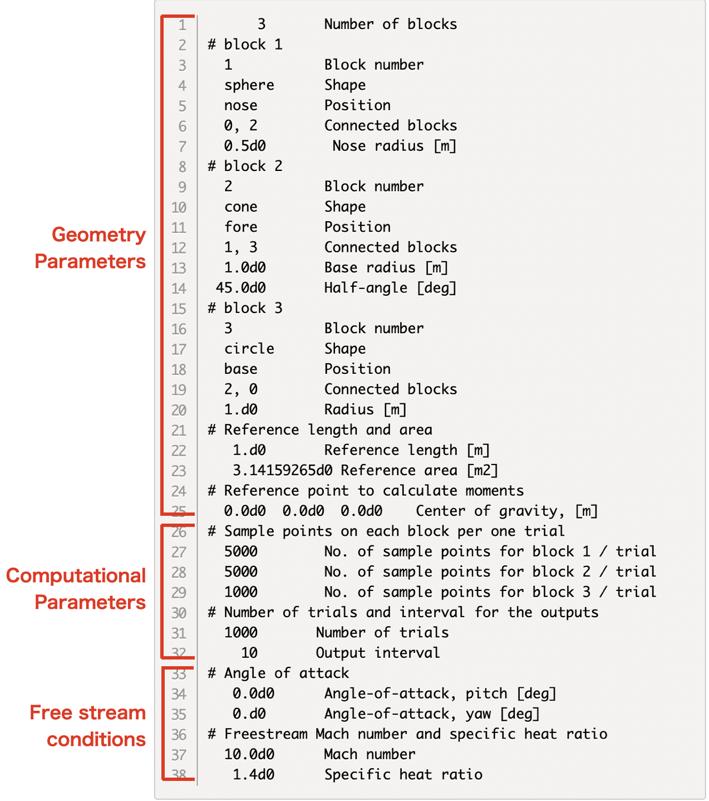 |
|:--------------------------------------:|
|Fig.2-1 Structure of input file of the calculation for a sphere-cone in fig. 2-2 |

| 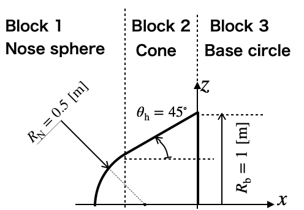 |
|:--------------------------------------:|
|Fig.2-2 An example of sphere-cone geometry |


The line-by-line explanations are given in the following subsections.


```
      3       Number of blocks
# block 1
  1           Block number
  sphere      Shape
  nose        Position
  0, 2        Connected blocks
  0.5d0        Nose radius [m]
# block 2
  2           Block number
  cone        Shape
  fore        Position
  1, 3        Connected blocks
  1.0d0       Base radius [m]
 45.0d0       Half-angle [deg]
# block 3
  3           Block number
  circle      Shape
  base        Position
  2, 0        Connected blocks
  1.d0        Radius [m]
# Reference length and area
   1.d0       Reference length [m]
   3.14159265d0 Reference area [m2]
# Reference point to calculate moments
  0.0d0  0.0d0  0.0d0    Center of gravity, [m]
# Sample points on each block per one trial
  5000        No. of sample points for block 1 / trial
  5000        No. of sample points for block 2 / trial
  1000        No. of sample points for block 3 / trial
# Number of trials and interval for the outputs
  1000       Number of trials
    10       Output interval
# Angle of attack
   0.0d0      Angle-of-attack, pitch [deg]
   0.d0       Angle-of-attack, yaw [deg]
# Freestream Mach number and specific heat ratio
  10.0d0      Mach number
   1.4d0      Specific heat ratio
```


###<a name="2-2"></a>2-2. Geometry parameters

MC-New can treat only axisymmetric geometries; sphere, cone, sphere-cone, circle, or shoulder(torus). The symmetric axis coincides with the x-axis. 

* **Number of blocks**
   
	- Line 1:  **nblk** (integer): Number of blocks consisting of the whole geometry


	
* **Definition of geometries in each block**
  
  - Line 2:  "\# block 1" : This line is read as a dummy character
  - Line 3: **iblk** (integer): Blocks number
  - Line 4: **gtype(iblk)** (charactor(8)): Shape (sphere / cone / sphere-cone / circle / shoulder)
  - Line 5: **ptype(iblk)** (charactor(8)): Position
  - Line 6: **icnctm(iblk), icnctp(iblk)** (integer): Block numbers of connected neighbor blocks. icnctm is the block number placed on the negative $x$ side. icnctp is the block number placed on the positive $x$ side. If no blocks are connected, give 0.
  - Line 7: **Geometry parameter lists** : The lists are depends on the choices of the shape and position. See Table 1. Use one line for one parameter.
  
* **Reference length, area, and point**

  - Line 21: "\# Reference..." : This line is read as a dummy character
  - Line 22: **len_ref** (real(8)): Reference length in meters. Usually taken as the total length of the whole geometry along the symmetry axis. This reference length is used only in the calculation of moment coefficients.
  - Line 23: **area_ref** (real(8)): Reference area in square meters. Usually taken as the area projected on the $yz$ plane.
  - Line 24: "\# Reference..." : This line is read as a dummy character
  - Line 25: **cg(1),cg(2),cg(3)** (real(8)): $xyz$-coordinates of the reference center point of moment. Usually taken as the center of gravity. This reference point is used only in the calculation of moment coefficients.


		**Table 1 Keywords of shape and position types and geometry parameters to be listed**

		Shape type <br> keyword    | Position type  <br> keyword    | Parameters        | |
--------------------|------------------|------------------|:---:|
sphere   | nose     | Radius, $R_N$ [m] |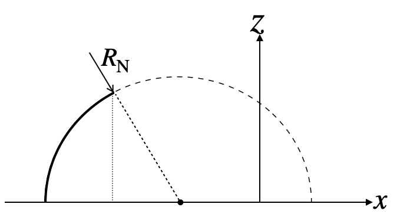|
         | tail     | Radius, $R_N$ [m] |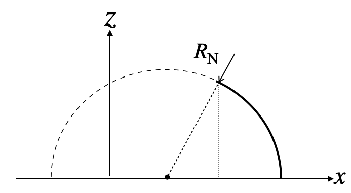|
         | full     | Radius, $R_N$ [m] |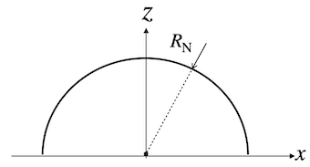|
cone     | fore     | Base radius, $R_b$ [m] <br> Half angle, $\theta_h$ [deg] |  |
         | rear     | Base radius, $R_b$ [m] <br> Half angle, $\theta_h$ [deg] |  |
shoulder | cone-cone |   Shoulder arc radius, $R_{sh}$ [m]  <br>  Shoulder base radius, $R_{b}$  [m] <br> or <br>   Shoulder arc radius, $R_{sh}$ [m]  <br>  Dummy radius, $R_{b} < 0$  [m]<br>  (Auto-calculation of $R_{b}$) |  <br>   |
         | cone-sph  |  Shoulder arc radius, $R_{sh}$ [m]  <br>  Bottom base radius, $R_{b}$ [m]  | 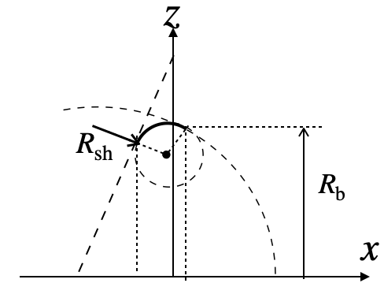  |
         | sph-cone  |  Shoulder arc radius, $R_{sh}$ [m]  <br>  Top base radius, $R_{b}$ [m]  | 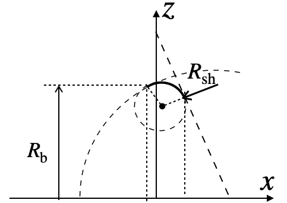  |
         | sph-sph   | Shoulder arc radius, $R_{sh}$ [m]  <br>  Top base radius, $R_{b1}$ [m] <br>  Bottom base radius, $R_{b2}$ [m] | 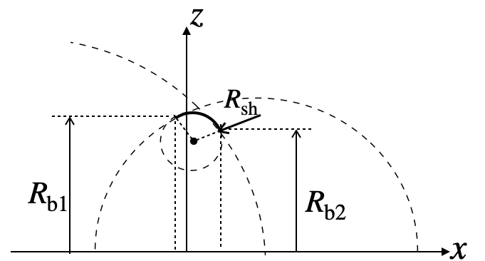  |
 cylinder| horizon  | Base radius, $R_b$ [m] <br> Height, $l$ [m] |   |
         |vertical | Base radius, $R_b$ [m] <br> Height, $l$ [m] |   |
circle   | top      | Base radius, $R_b$ [m] |   |
         | bottom   | Base radius, $R_b$ [m] |   |
  


###<a name="2-3"></a>2-3. Computational parameters

* **Number of sample points and trials**

  - Line 26: "\# Sample ..." : This line is read as a dummy character
  - Line 27~29: **nsmpb(iblk)** (integer): Number of sample points on the surface of each block from Block 1 to Block **nblk**. Use one line for one block. 
  - Line 30: "\# Number of ..." : This line is read as a dummy character
  - Line 31: **ntry** (integer): Number of trial. Total number of sample points on Block **iblk** is given by **(ntry)*(nsmpb(iblk))** 
  - Line 32: **iout** (integer): Interval of trial steps for outputting intermediate results. 


###<a name="2-4"></a>2-4. Freestream conditions

* **Angle-of-attack, Mach number and specific heat ratio**

  - Line 33: "\# Angle ..." : This line is read as a dummy character
  - Line 34: **alp_deg** (real(8)): Pitch angle of attack in degree.
  - Line 35: **bet_deg** (real(8)): Yaw angle of attack in degree.
  - Line 36: "\# Freestream ..." : This line is read as a dummy character
  - Line 37: **amach** (real(8))): Mach number of the freestream. This parameter is used to calculate aerodynamics by the modified Newtonian theory. 
  - Line 38: **gam** (real(8))): Specific heat ratio of the gas of the freestream. This parameter is used to calculate aerodynamics by the modified Newtonian theory. 

 
[Back to Contents](#contents)
 
## <a name="Outputs"></a> 3. Outputs

###<a name="3-1"></a>3-1. Typical outputs on the console

```
 input: number of blocks
           3
 input: block numnber
           1
 input: shapes of blocks
 sphere
 input: position of blocks
 nose
 input: Neighboring block numbers
           0           2
 input: radius of spherer, [m]
   1.0000000000000000
 input: block numnber
           2
 input: shapes of blocks
 cone
 input: position of blocks
 fore
 input: Neighboring block numbers
           1           3
 input: base radius of cone, [m]
   1.0000000000000000
 input: Half angle of cone, [deg]
   45.000000000000000
 input: block numnber
           3
 input: shapes of blocks
 circle
 input: position of blocks
 base
 input: Neighboring block numbers
           2           0
 input: radius, [m]
   1.0000000000000000

  ================================
  Block #  Shape       Position
  -------- ----------  ----------
     1       sphere        nose
     2         cone        fore
     3       circle        base
  ================================

  ========================================================================================
  SUMMARY OF GEOMETRIES
  ========================================================================================
   Block #  Shape         Position      R [m]          angle[deg]   h [m]         x0 [m]
   ------- ----------  ----------   ------------  ------------  ------------  ------------
     1       sphere        nose       1.000000      0.000000      0.000000      1.000000
     2         cone        fore       1.000000     45.000000      1.000000     -0.414214
     3       circle        base       1.000000      0.000000      0.000000      0.585786
  ==========================================================================================================
   Block #  Param1 min    Param1 max    max - min     Param2 min    Param2 max    max - min     Area
  -------- ------------  ------------  ------------  ------------  ------------  ------------  ------------
     1      0.00000000    6.28318531    6.28318531   -1.57079633   -0.78539816    0.78539816    4.93480220
     2      0.70710678    1.00000000    0.29289322    0.00000000    6.28318531    6.28318531    1.84030237
     3      0.00000000    1.00000000    1.00000000    0.00000000    6.28318531    6.28318531    6.28318531
  ======================================================================================================================================
   Block #    x min          x max         x len        y min          y max         y len        z min          z max         z len
  -------- ------------  ------------  ------------  ------------  ------------  ------------  ------------  ------------  ------------
     1      0.00000000    0.29289322    0.29289322   -0.70710678    0.70710678    1.41421356   -0.70710678    0.70710678    1.41421356
     2      0.29289322    0.58578644    0.29289322   -1.00000000    1.00000000    2.00000000   -1.00000000    1.00000000    2.00000000
     3      0.58578644    0.58578644    0.00000000   -1.00000000    1.00000000    2.00000000   -1.00000000    1.00000000    2.00000000
  -------- ------------  ------------  ------------  ------------  ------------  ------------  ------------  ------------  ------------
   Total    0.00000000    0.58578644    0.58578644   -1.00000000    1.00000000    2.00000000   -1.00000000    1.00000000    2.00000000
  ======================================================================================================================================

   Reference area:   3.1415926500000002      [Deg]
   Reference length:   1.0000000000000000      [Deg]
  ====================================

  ================================================
   Free stream conditions
  ------------------------------------------------
   Mach number, M:   10.000000000000000
   Specific heat ratio:   1.3999999999999999
   Maxumum pressure coef, Cp0:   1.8316709773875366
   Pitch angle:   0.0000000000000000      [Deg]
   Yaw angle:   0.0000000000000000      [Deg]
  ================================================
   Computation conditions
  ------------------------------------------------
   Number of sample points:
      Block #           1 :        5000 /trial
      Block #           2 :        5000 /trial
      Block #           3 :        1000 /trial
   Number of trial test:         1000
   Interval for output:          10
  ================================================


  ************************************************  << Iteration start >>  ***********************************************
#  Trial                   Local step values                                      Cumulative average
  ---------- ------------------------------------------------------  ------------------------------------------------------
#  number           ivisible       CD           CLy           CLz           ivisible       CD           CLy           CLz
  ---------- ------------  ------------  ------------  ------------  ------------  ------------  ------------  ------------
          10         10000    1.25147185   -0.00991070    0.01119672        100000    1.24976248    0.00139312    0.00501194
          20         10000    1.24491842    0.00577336    0.01068176        200000    1.24999476    0.00139914    0.00382997
          30         10000    1.25414732   -0.00847324    0.00611984        300000    1.25030451    0.00034396    0.00183712
          40         10000    1.25290478   -0.00215000   -0.00119800        400000    1.25025153    0.00021929    0.00164828
          50         10000    1.24432608    0.00906275   -0.00861712        500000    1.25016623    0.00120797    0.00185455
...
... Skip lines
...
         950         10000    1.25318867    0.00764746    0.00040978       9500000    1.24986042   -0.00012443    0.00049939
         960         10000    1.24651088   -0.00420243   -0.00798521       9600000    1.24986180   -0.00015018    0.00051028
         970         10000    1.24989361    0.01649202    0.02228083       9700000    1.24986268   -0.00010862    0.00053379
         980         10000    1.25865271   -0.00290644   -0.01066874       9800000    1.24988087   -0.00009274    0.00051064
         990         10000    1.24897690   -0.01017070   -0.00642469       9900000    1.24988224   -0.00010883    0.00048966
        1000         10000    1.24516336    0.00654054    0.00289354      10000000    1.24986826   -0.00007591    0.00047082
  ***********************************************  << End of iteration >>  ***********************************************


  ==================================================================================================================
  SUMMARY
  ==================================================================================================================
  Aerodynamic coefficients of each blocks
  ------------------------------------------------------------------------------------------------------------------
  Block #    Shape     CD_av         CLy_av        CLz_av        L/D           CA_av         CNy_av        CNz_av
  ------- ---------  ------------  ------------  ------------  ------------  ------------  ------------  ------------
     1       sphere    0.74988118    0.00011678    0.00029441    0.00801141    0.74988118    0.00011678    0.00029441
     2         cone    0.49998708   -0.00019269    0.00017641    0.01252141    0.49998708   -0.00019269    0.00017641
     3       circle    0.00000000    0.00000000    0.00000000    0.00000000    0.00000000    0.00000000    0.00000000
  -----------------  ------------  ------------  ------------  ------------  ------------  ------------  ------------
  Total                1.24986826   -0.00007591    0.00047082    0.00038156    1.24986826   -0.00007591    0.00047082
  Modified newtonia    1.14467371   -0.00006952    0.00043119    0.00038156    1.14467371   -0.00006952    0.00043119
  ==================================================================================================================
  Moment coefficients of each blocks
  ------------------------------------------------------------------------------------------------------
  Block #    Shape    Cm,0,x        Cm,0,y        Cm,0,z       Cm,cg,x       Cm,cg,y       Cm,cg,z
  ------- ---------  ------------  ------------  ------------  ------------  ------------  ------------
     1       sphere    0.00000000   -0.00029441    0.00011678    0.00000000   -0.00029441    0.00011678
     2         cone    0.00000000   -0.00021027   -0.00030672    0.00000000   -0.00021027   -0.00030672
     3       circle    0.00000000    0.00000000    0.00000000    0.00000000    0.00000000    0.00000000
  -----------------  ------------  ------------  ------------  ------------  ------------  ------------
  Total                0.00000000   -0.00050467   -0.00018994    0.00000000   -0.00050467   -0.00018994
  Modified newtonia    0.00000000   -0.00046220   -0.00017395    0.00000000   -0.00046220   -0.00017395
  Cm,cg-Cm,0           0.00000000    0.00000000    0.00000000
  Cm,cg-Cm,0 (MN)      0.00000000    0.00000000    0.00000000
  ======================================================================================================
  Visible area
  ---------------------------------------------------------------------------
  Block #        Visible     Projected      ivisible       nsample
  --------    ----------    ----------    ----------    ----------
     1        1.83982697    1.57044434     5000000 /       5000000
     2        2.22138406    1.57075574     5000000 /       5000000
     3        0.00000000    0.00000000           0 /       1000000
  --------                  ----------    ----------    ----------
  Total       4.06121103    3.14120008    10000000 /      11000000
  --------                  ----------
  Ref.                      3.14159265
  ===========================================================================

  ================================================
   Computation info
  ------------------------------------------------
   CPU time :   4.2699618339538574      sec
   Real time:           4 sec
   Number of trials        1000 times
   Total number of sample points    11000000 points
  ================================================
```

  * Line 1~34: Displaying raw inputs
  * Line 36~42: Summary geometry shape types and position types
  * Line 46~51: Summary of input geometry parameters (Nose/base radius, half-angle, length, $x$ coordinate of the base)
  * Line 52~57: Summary of minimum and maximum values of variables $\eta$ and $\xi$ in the parametric domain. These values give the range of integration in each block.
  * Line 58~65: Summary of minimum and maximum values of $xyz$ coordinates of each block. 
  * Line 68~69: Displaying input reference length and area.
  * Line 72~79: Displaying input freestream conditions. (Mach number and specific heat ratio)
  * Line 80~88: Displaying input computational parameters.
  * Line 93~112: Intermediate outputs of the results
  
  	- Column 1: Trial step number, **itry**
  	- Column 2: Number of visible points within the (**itry**)th triral step.
  	- Column 3~5: Drag, lift and side force coefficients at the (**itry**)th trial step.
  	- Column 6: Cumulative number of visible points from the first trial step to the (**itry**)th trial step.
  	- Column 7~9: Cumulative average of drag, lift and side force coefficients over the (**itry**) steps of trials.

  - Line 124~126:  Final results of aerodynamic coefficients for the whole geometry  	
  	- Column 1: Block number
  	- Column 2: Shape type of the block
  	- Column 3~5: Drag, and lift force coefficients in the space coordinates for each block
  	- Column 6: Lift-to-drag ratio for each block
  	- Column 7~8: Axial, normal and side force coefficients in the body-fixed coordinates.
  
  - Line 127: Final results of aerodynamic coefficients for the whole geometry
  - Line 128: Aerodynamic coefficients form the Modified Newtonian theory
  - Line 135~137:  Final results of moment coefficients for each block  	
  	- Column 1: Block number
  	- Column 2: Shape type of the block
  	- Column 3~5: Rolling, pitching, and yawing moment coefficients about axis passing through the tip of the nose.
  	- Column 6~8: Rolling, pitching, and yawing moment coefficients about axis passing through the center of gravity.
  	
  - Line 138: Final results of moment coefficients for the whole geometry.
  - Line 139: Moment coefficients form the Modified Newtonian theory
  - Line 140: Difference of moment coefficients between the center of gravity and the origin
  - Line 140: Difference of moment coefficients from the modified Newtonian theory
  - Line 144~155: Summary of the visible points and area.
  - Line 157~164: Summary of the computational time.

###<a name="3-2"></a>3-2. Output files

* visible\_points.dat: Position vectors of the visible sample points and local pressure coefficients

	- Column 1~3: Position vector in the body-fixed coordinates of the visible sample points
	- Column 4: Local pressure coefficient 
	- Column 5~7: Components of the pressure coefficient

* hidden\_points.dat: Position vectors of the hidden sample points.
	
	- Column 1~3:Position vector in the body-fixed coordinates of the invisible sample points
	- Column 4: Local pressure coefficient (0 for all points)
	- Column 5~7: Components of the pressure coefficient (0 for all points)

* convergence.dat: Log of the intermediate results (Same contents as Line 93~112 in the console outputs)

* NEW\_aero\_coefs.dat: Aerodynamic coefficients calculated by the original Newtonian theory

	- Column 1: Mach number
	- Column 2: Specific heat ratio
	- Column 3: Pitch angle
	- Column 4: Yaw angle
	- Column 5: Drag force coefficient
	- Column 6: $y$ component of lift force coefficient
	- Column 7: $z$ component of lift force coefficient
	- Column 8: Lift-to-drag ratio
	- Column 9: Axial force coefficient
	- Column 10: Normal force coefficient
	- Column 11: Side force coefficient
	- Column 12: Rolling moment coefficient about the axis passing through the center of gravity
	- Column 13: Pitching moment coefficient about the axis passing through the center of gravity
	- Column 14: Yawing moment coefficient about the axis passing through the center of gravity
	- Column 15: Rolling moment coefficient about the axis passing through the tip of the nose
	- Column 16: Pitching moment coefficient about the axis passing through the tip of the nose
	- Column 17: Yawing moment coefficient about the axis passing through the tip of the nose

* MN\_aero\_coefs.dat: Aerodynamic coefficients calculated by the Modified Newtonian theory (Same contents of columns in the "NEW\_aero\_coefs.dat")


[Back to Contents](#contents)


###<a name="3-3"></a>3-3. Visualize the sample points

The sample points used in the calculation in the first trial can be visualized by using GNUPLOT and so on. The following is an example of the script for GNUPLOT

```
set view equal xyz
set view 90,0, 1, 1
unset border
unset tics
set ticslevel 0
#
set cbrange[0:1.5]
set cbtics 0.4 offset -0.8,2 font "Helvetica, 18"
set palette defined (0 "green", 0.75 "yellow", 1.5 "red")
#
set cblabel "Cp" offset -3.0,11 font "Helvetica, 20" rotate by 0
splot "visible_points.dat" using 1:2:3:4 w points pt 7 ps 0.3 lc palette notitle, "hidden_points.dat" using 1:2:3:4 w points pt 7 ps 0.3 lc "grey" notitle
#
``` 

With this script, GNUPLOT displays the picture below. (Appearance can be different depending on the environment.)

 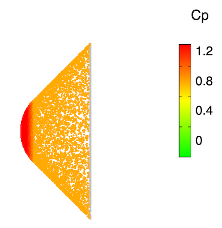 


[Back to Contents](#contents)


## <a name="Examples"></a> 4. Example inputs and outputs


### <a name="ex1"></a> Example 1: Sphere

Calculate aerodynamic coefficients for a sphere with a radius of 1 [m].

 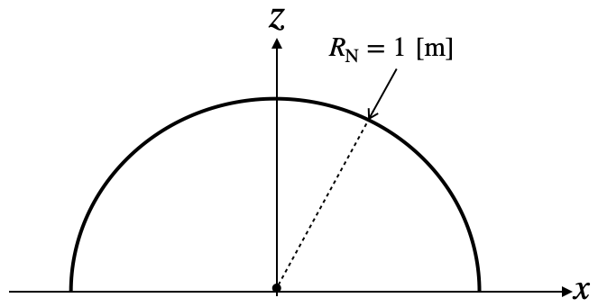 

**Input file**

```
      1       Number of blocks
# block 1
  1           Block number
  sphere      Shape
  full        Position
  0, 0        Connected blocks
  1.d0        Nose radius [m]
# Reference length and area
   1.d0       Reference length [m]
   3.14159265d0 Reference area [m2]
# Reference point to calculate moments
   0.d0 0.0d0  0.0d0    Center of gravity, [m]
# Sample points on each block per one trial
 10000        No. of sample points for block 1 / trial
# Number of trials and interval for the output
  1000       Number of trials
    10       Output interval
# Angle of attack
   0.0d0      Angle-of-attack, pitch [deg]
   0.d0       Angle-of-attack, yaw [deg]
# Freestream Mach number and specific heat ratio
  10.0d0      Mach number
   1.4d0      Specific heat ratio
```

**Outputs**

NEW\_aero\_coefs.dat

```
#===========================================================================
#  Aerodynamic coefs by Newtoninan theory
#===========================================================================
# Mach    Gamma   Alpha   Beta    CD           CL,y         CL,z         L/D          CA           CN,y         CN,z         Cm,x cg      Cm,y cg      Cm,z cg      Cm,x O       Cm,y O       Cm,z O
     10.00     1.40     0.00     0.00   1.00044574   0.00017648  -0.00032248  -0.00032233   1.00044574   0.00017648  -0.00032248  -0.00000000   0.00032248   0.00017648  -0.00000000   0.00032248   0.00017648
```

visible\_points.dat and hidden\_points.dat

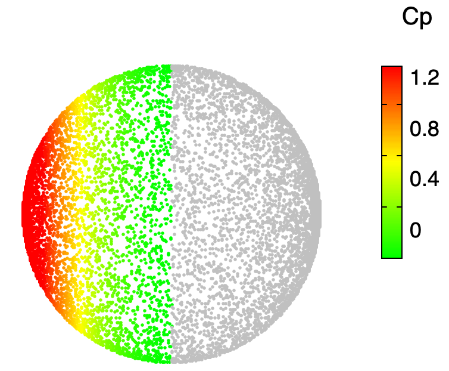 


[Back to Contents](#contents)

### <a name="ex2"></a> Example 2: Cone


Calculate aerodynamic coefficients for a cone with a base radius of 1 [m] and half-angle of 45 [deg].

  

**Input file**


```
      1       Number of blocks
# block 1
  1           Block number
  cone        Shape
  fore        Position
  0, 0        Connected blocks
  1.0d0       Cone base radius [m]
 45.0d0       Cone half-angle [deg]
# Reference length and area
   1.d0       Reference length [m]
   3.14159265d0 Reference area [m2]
# Reference point to calculate moments
  0.d0 0.d0  0.d0    Center of gravity, [m]
# Sample points on each block per one trial
 10000        No. of sample points for block 1 / trial
# Number of trial and interval for ouput
  1000       Number of trials
    10       Ouput interval
# Angle of attack
   0.d0      Angle-of-attack, pitch [deg]
   0.d0       Angle-of-attack, yaw [deg]
# Freestream Mach number and specific heat ratio
  10.0d0      Mach number
   1.4d0      Specific heat ratio
```

**Outputs**

NEW\_aero\_coefs.dat

```
#===========================================================================
#  Aerodynamic coefs by Newtoninan theory
#===========================================================================
# Mach    Gamma   Alpha   Beta    CD           CL,y         CL,z         L/D          CA           CN,y         CN,z         Cm,x cg      Cm,y cg      Cm,z cg      Cm,x O       Cm,y O       Cm,z O
     10.00     1.40     0.00     0.00   1.00027043   0.00020074  -0.00014558  -0.00014554   1.00027043   0.00020074  -0.00014558  -0.00000000   0.00031665   0.00030795  -0.00000000   0.00031665   0.00030795
```

visible\_points.dat and hidden\_points.dat

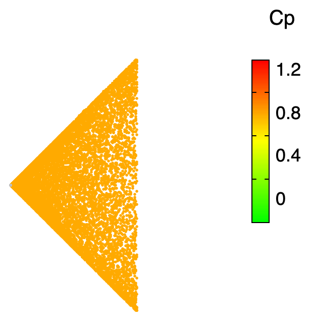 


[Back to Contents](#contents)

### <a name="ex3"></a> Example 3: Biconical object

Calculate aerodynamic coefficients for a biconical geometry.

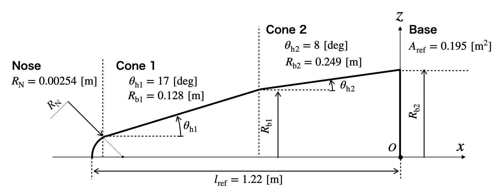 

**Input file**

```
      4       Number of blocks
# block 1
  1           Block number
  sphere      Shape
  nose        Position
  0, 2        Connected blocks
0.0254d0      Nose radius [m]
# block 2
  2           Block number
  cone        Shape
  fore        Position
  1, 3        Connected blocks
0.127579d0    Cone base radius [m], (x=0)
 17.0d0       Cone half-angle [deg]
# block 3
  3           Block number
  cone        Shape
  fore        Position
  2, 4        Connected blocks
0.2492d0      Cone base radius [m], (x=0)
  8.0d0       Cone half-angle [deg]
# block 4
  4           Block number
  circle      Shape
  bottom      Position
  3, 0        Connected blocks
0.2492d0      Radius [m]
# Reference length and area
  1.22119478  Reference length [m]
  0.194657d0  Reference area [m]
# Reference point to calculate moments
  1.22119478  0.d0 0.d0   Center of gravity
# Sample points on each block per one trial
  1000        Block 1
 50000        Block 2
150000        Block 3
  5000        Block 4
# Number of trial and interval for averaging
  100         Number of trials
   10         Ouput interval
# Angle of attack
  10.d0    Angle-of-attack, pitch [deg]
  20.d0    Angle-of-attack, yaw [deg]
# Freestream Mach number and specific heat ratio
   10.d0   Mach number
   1.4d0   Specific heat ratio
```

**Outputs**

NEW\_aero\_coefs.dat

```
	#===========================================================================
	#  Aerodynamic coefs by Newtoninan theory
	#===========================================================================
	# Mach    Gamma   Alpha   Beta    CD           CL,y         CL,z         L/D          CA           CN,y         CN,z         Cm,x cg      Cm,y cg      Cm,z cg      Cm,x O       Cm,y O       Cm,z O
    10.00     1.40    10.00    20.00   0.47542649  -0.75477049   0.30228007   0.63580822   0.18997945  -0.71359675   0.34044173  -0.00000000   0.13627618   0.28563578  -0.00000000  -0.20416555  -0.42796098
```

visible\_points.dat and hidden\_points.dat

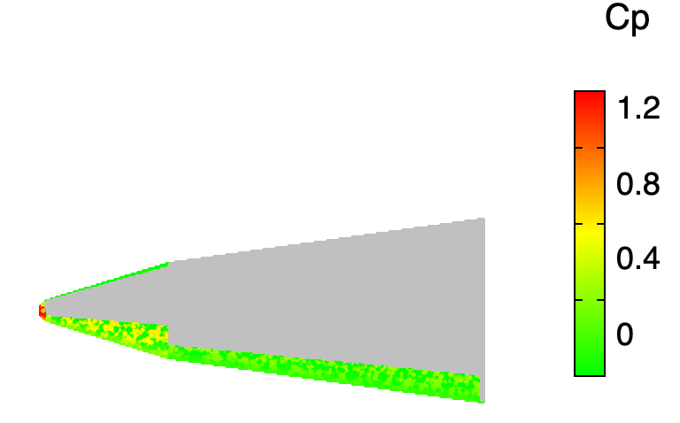 


[Back to Contents](#contents)


### <a name="ex4"></a> Example 4: Apollo capsule

Calculate aerodynamic coefficients for Apollo command module geometry.

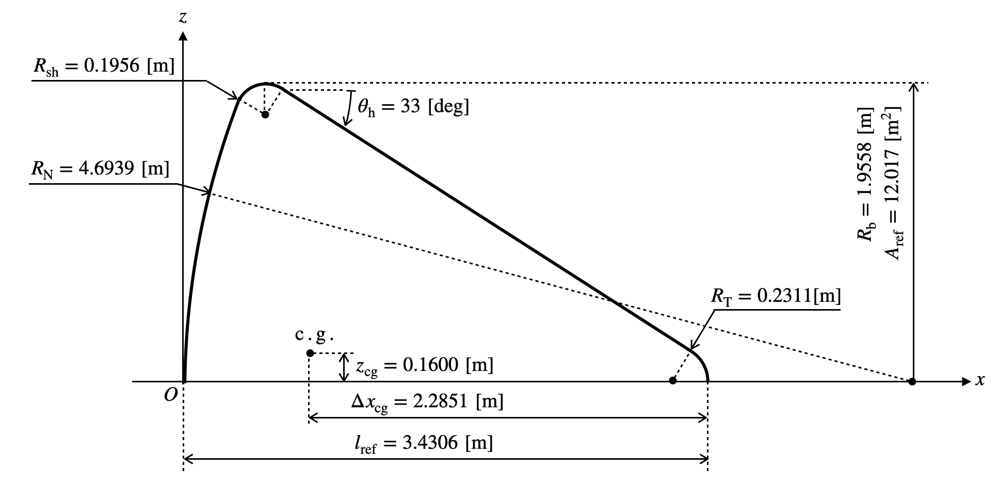 

**Input file**

```
      4       Number of blocks
# block 1
  1           Block number
  sphere      Shape
  nose        Position
  0, 2        Connected blocks
  4.6939d0    Nose radius [m]
# block 2
  2           Block number
  shoulder    Shape
  sph-cone    Position
  1, 3        Connected blocks
  0.1956d0    Shoulder arc radius [m]
  1.8368d0    Radius of nose base [m]
# block 3
  3           Block number
  cone        Shape
  rear        Position
  2, 4        Connected blocks
  1.9933d0    Cone base radius [m], (x=0)
 33.0d0       Cone half-angle [deg]
# block 4
  4           Block number
  sphere      Shape
  tail        Position
  3, 0        Connected blocks
  0.2311d0    Radius [m]
# Reference length and area
   3.4306d0      Reference length [m]
  12.01707457d0  Reference area [m2]
# Reference point to calculate moments
 1.1455d0 0.0d0  0.1600d0    Center of gravity, [m]
# Sample points on each block per one trial
 10000        No. of sample points for block 1 / trial
  4000        No. of sample points for block 2 / trial
 19000        No. of sample points for block 3 / trial
  1000        No. of sample points for block 3 / trial
# Number of trial and interval for output
  1000        Number of trials
   10         Ouput interval
# Angle of attack
  -25.0d0     Angle-of-attack, pitch [deg]
   0.d0       Angle-of-attack, yaw [deg]
# Freestream Mach number and specific heat ratio
  30.0d0         Mach number
   1.4d0         Specific heat ratio
```

**Outputs**

NEW\_aero\_coefs.dat

```
#===========================================================================
#  Aerodynamic coefs by Newtoninan theory
#===========================================================================
# Mach    Gamma   Alpha   Beta    CD           CL,y         CL,z         L/D          CA           CN,y         CN,z         Cm,x cg      Cm,y cg      Cm,z cg      Cm,x O       Cm,y O       Cm,z O
     30.00     1.40   -25.00     0.00   1.20500274   0.00004079   0.46544388   0.38625960   1.28880845   0.00004079  -0.08742075   0.00000190  -0.01080942   0.00000913  -0.00000000   0.07848977   0.00002275
```

visible\_points.dat and hidden\_points.dat

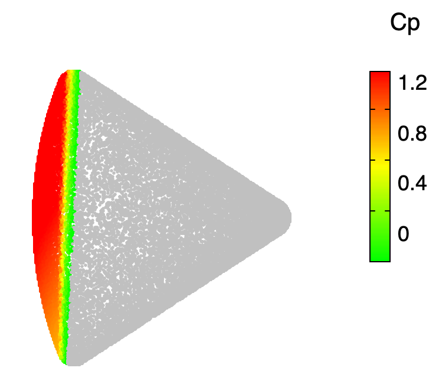 


[Back to Contents](#contents)
